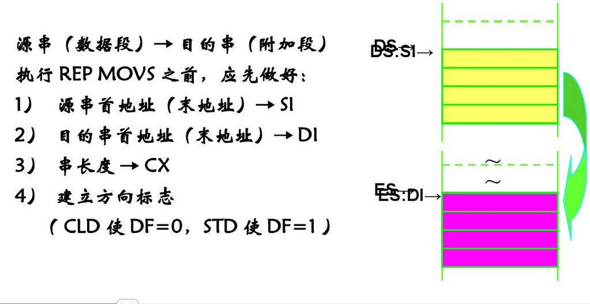

## 操作内存
#### 一些基础概念的知识
+ mem表示内存地址；reg指的是寄存器
+ DS是当前程序使用的数据所存放段的最低地址，是段寄存器，用来存储段地址的，程序是通过段地址：偏移地址寻找数据地址的。
+ 段寄存器DS指向数据段，ES指向附加段，在存取操作数时，二者之一和一个偏移量合并就可得到存储单元的物理地址。该偏移量可以是具体数值、符号地址和指针寄存器的值等之一，具体情况将由指令的寻址方式来决定。
+  loop指令的格式是：loop标号（循环指令），cpu执行loop指令的时候，要进行两步操作：
1、（cx）=（cx）-1   
2、判断cx中的值，不为零则转至标号处执行，如果为零，则向下执行
+ 字节与字、双字的区别：
计算机内存中，最小的存储单位是“位（bit）”，**8bit构成一个“字节”**，字节是内存的基本单位，也是编址单位；**两个“字节”，称为一个“字”**。**双字为32bit**，两个字，四个字节
#### 例子
	mov ax,[0]
方括号内的数值不是立即数，而是偏移量，表示的是内存中的数值，[0]表示DS：0中的那个字；
#### 描述内存宽度的操作符
|  操作符 | 意义  |
| :------------ | :------------ |
|  byte ptr | 一个字节（8-bit，1 byte）|
|  word ptr | 一个字（16-bit）  |
|  dword ptr | 一个双字（32-bit）  |

例子：
+ ```mov word ptr [100h],01234h```
表示在DS：100h对应的地址上保存1234h
+ 同样内存与寄存器的数据可以进行赋值等操作，即内存可以和寄存器交换数据，mov指令可以扩展为：
```mov reg(8,16,32),mem(8,16,32)
mov mem(8,16,32),reg(8,16,32)
mov mem(8,16,32),imm(8,16,32)
```
注：mem是指内存，reg是指寄存器，imm是指立即数，（8，16，32）应该是指8bit、16bit、32bit的都可以相互赋值
+ 其中，[]指的是偏移地址，但也可以作加减运算
#### 串操作
##### 一些基本的串指令
某些指令可以加上`REP`前缀，这些指令通常被叫做`串操作指令`。
1. cx 重复次数计数器
2. movs 串传送（movsb 传送字符；movsw传送字）
3. cmps 串比较（cmpsb 比较字符。 cmpsw 比较字）
4. stos 保存串
5. DS:SI 源串段寄存器 :源串变址.
6. ES:DI 目标串段寄存器:目标串变址.
7. LODS 装入串
8. scas 串扫描
汇编指令的串指令参考：
https://zhidao.baidu.com/question/266417367957223405.html?qbl=relate_question_1&word=ins%20%BB%E3%B1%E0

把内存的某部分内容复制到另一个地址，可以利用loop指令循环，一个个mov过去，如：
		
```
mov cx,512			;循环次数
NextByte:	mov al,ds:[si]
			mov es:[si],al
			inc si
			inc di
			loop NextByte 

```
这里没有用到串操作，可以直接用movs/movsd来进行串传送。

串操作就是由CPU去完成`某一数量的重复的内存操作`

##### 串输入指令 INS
+ 功能：将由DX寄存器指定的I/O端口中的字、字节传送到附加段中的目的串中，并根据DF和数据类型来改变目的变址寄存器的方向内容。
+ 格式：INSB；字符串输入：ES：[DI]<-((DX)),
DI<-DI+/-1
INSW ;字串串输入：ES:[DI]<-((DX)),;DI<-DI+/-2
##### 与REP配合工作的MOVS/STOS/LODS的指令
+  重复前缀指令REP(CX依次减一，直到CX为0就结束)，是指重复其后的字符串操作指令，重复的次数由CX来决定。
格式一般为：REP MOVS/STOS/LODS
+ 字符串传送指令：将以SI为指针的源串中的一个字节（或字）存储单元中的数据传送至以DS为指针的目的地址中去，并自动修改指针，使之指向下一个字节（或字）存储单元。即：
1. （DS:[SI]）->ES：[DI]
2. 当DF=0时，（SI）和（DI）增量；
当DF=1时，（SI）和（DI）减量。

指令格式：
+ MOVS DST，SRC（需在操作数中表明数据格式）
+ MOVSB（字节）
+ MOVSW（字）

注：字节操作：（SI）<-（SI）+/-1，(DI)<-(DI)+/-1
字操作：（SI）<-（SI）+/-2，(DI)<-(DI)+/-2
REP MOVS ：将数据段中的整串数据传送到附加段中。

##### 置字符串数据指令（保存串）
功能：将AL或AX中的数据送入EI：DI所指的目的串中的字节（或字）存储单元中。即：
1. 字节操作：（AI）->[DI]，字操作：(AX)->[DI] 
2. 修改指针DI，使之指向串中的下一个元素。
当DF=0时，（DI）增量。当DF=1时，（DI）减量

指令的格式：
STOS DST （需在操作数中表明数据格式）
STOSB（字节）
STOSW（字）
##### 取字符串数据指令（装入串）
功能：将SI所指的源串中的一个字节（或字）存储单元中的数据取出来送AL（或AX）中。即：
1. 字节操作：（[SI]）->AL，字操作：([SI])->AX 
2. 修改指针SI，使之指向串中的下一个元素。
当DF=0时，（SI）增量。当DF=1时，（SI）减量
指令的格式：
LODS SRC（需在操作数中表明数据格式）
LODSB（字节）
LODSW（字）
注：1、源串一般在数据段中（允许使用段跨越前缀来修改），目的串必须在附加段中。2、不影响条件标志位
##### 串输出指令OUTS
功能：将由源串中的字、字节传送到在DX寄存器指定的I/O端口中，并根据DF和数据类型来改变目的变址寄存器的方向内容。（与INS对比，一个输入一个输出）
格式：
+ INSB；字符串输出：((DX))<-DS:[SI]：SI<-SI+/-1
+ INSW ;字串串输出：((DX))<-DS:[SI]；SI<-SI+/-2

参考文档：
https://wenku.baidu.com/view/717b8d23f7ec4afe05a1df2a.html

#### 一个经典例子和说明
|  操作码  | 指令  | 说明  |
| :------------ | :------------ | :------------ |
| F3 6C  | REP INS r/m8,DX  | 将 (E)CX个字节从端口 DX 输入到ES:[(E)DI]  |
| F3 6D | REP INS r/m16,DX  | 将 (E)CX 个字从端口 DX 输入到 ES:[(E)DI]  |
| F3 6D  | REP INS r/m32,DX  | 将 (E)CX 个双字从端口 DX 输入到 ES:[(E)DI]  |
| F3 A4  | REP MOVS m8,m8  | 将 (E)CX 个字节从 DS:[(E)SI] 移到 ES:[(E)DI]  |
| F3 A5  | REP MOVS m16,m16  | 将 (E)CX 个字从 DS:[(E)SI] 移到 ES:[(E)DI]  |
| F3 A5  | REP MOVS m32,m32  | 将 (E)CX 个双字从 DS:[(E)SI] 移到 ES:[(E)DI]  |
| F3 6E  | REP OUTS DX,r/m8  | 将 (E)CX 个字节从 DS:[(E)SI] 输出到端口 DX  |
| F3 6F  | REP OUTS DX,r/m16  | 将 (E)CX 个字从 DS:[(E)SI] 输出到端口 DX  |
| F3 6F  | REP OUTS DX,r/m32  | 将 (E)CX 个双字从 DS:[(E)SI] 输出到端口 DX  |
| F3 AC  | REP LODS AL  | 将 (E)CX 个字节从 DS:[(E)SI] 加载到 AL  |
| F3 AD  | REP LODS AX  | 将 (E)CX 个字从 DS:[(E)SI] 加载到 AX  |
| F3 AD  | REP LODS EAX  | 将 (E)CX 个双字从 DS:[(E)SI] 加载到 EAX  |
| F3 AA  | REP STOS m8  | 使用 AL 填写位于 ES:[(E)DI] 的 (E)CX 个字节  |
| F3 AB  |  REP STOS m16 | 使用 AX 填写位于 ES:[(E)DI] 的 (E)CX 个字  |
| F3 AB  | REP STOS m32  | 使用 EAX 填写位于 ES:[(E)DI] 的 (E)CX 个双字  |
| F3 A6  | REPE CMPS m8,m8  | 在 ES:[(E)DI] 与 DS:[(E)SI] 中查找不匹配的字节  |
| F3 A7  | REPE CMPS m16,m16  | 在 ES:[(E)DI] 与 DS:[(E)SI] 中查找不匹配的字  |
| F3 A7  | REPE CMPS m32,m32  | 在 ES:[(E)DI] 与 DS:[(E)SI] 中查找不匹配的双字  |
| F3 AE  | REPE SCAS m8  | 从 ES:[(E)DI] 开始查找非 AL 字节  |
| F3 AF  | REPE SCAS m16  | 从 ES:[(E)DI] 开始查找非 AX 字  |
| F3 AF  | REPE SCAS m32  | 从 ES:[(E)DI] 开始查找非 EAX 双字  |
| F2 A6  | REPNE CMPS m8,m8  | 在 ES:[(E)DI] 与 DS:[(E)SI] 中查找匹配字节  |
| F2 A7  | REPNE CMPS m16,m16  | 在 ES:[(E)DI] 与 DS:[(E)SI] 中查找匹配字  |
| F2 A7  | REPNE CMPS m32,m32  | 在 ES:[(E)DI] 与 DS:[(E)SI] 中查找匹配双字  |
| F2 AE  | REPNE SCAS m8  | 从 ES:[(E)DI] 开始查找 AL  |
| F2 AF  | REPNE SCAS m16  | 从 ES:[(E)DI] 开始查找 AX  |
| F2 AF  | REPNE SCAS m32  |从 ES:[(E)DI] 开始查找 EAX   |

结合上面对串操作指令的介绍和说明可以清楚知道整个操作过程。

注：REP 前缀一次只能应用于一条字符串指令。要重复指令块，请使用 LOOP 指令或其它循环结构。
#### 对于REP的问题
 | 重复前缀  | 终止条件1  | 终止条件2  |
| :------------ | :------------ | :------------ |
| REP  | ECX=0  | 无  |
| REPE/REPZ  | ECX=0  | ZF=0  |
| REPNE/REPNZ  | ECX=0  | ZF=1  |
**使用 REPE/REPZ 与 REPNE/REPNZ 前缀时，由于 CMPS 与 SCAS 指令都会根据它们的比较结果设置 ZF 标志，因此 ZF 标志不需要初始化。**

### OD的使用
52pojie工具包：https://down.52pojie.cn/


    

			
