### 堆栈
#### 一、对堆栈的理解
堆栈是内存中用于**存放数据**的专门保留的区域，该区域的数据存放和删除方式比较特殊。一般内存区域数据元素按照连续的方式存放到数据段，在数据段中最低内存开始存放，然后向更高的内存位置依次存放。而堆栈保留在内存区域的末尾位置，并且在当数据存放在堆栈中时，它向下增长。程序运行时使用的任何命令行参数都被送入堆栈中，并且堆栈指针被设置为指向数据元素的底部。
#### 二、堆栈的相关指令
##### push && pop
 堆栈操作使用了两个指令：push入栈、pop出栈
1. push 操作数
将sp指向前一个字单元（或字节单元），并把操作数放在sp所指的字单元（或字节单元）中。
2. pop 操作数
将sp所指的字单元（或字节单元）中的数据放到操作数中，这时的操作数不能是立即数，只能是寄存器或内存地址，然后让sp指向下一个字单元（或字节单元）。
3. 当然，也可以使用mov指令把sp所指向的数据挪到目的操作数中，只不过不改变sp的值。

**注：sp是一个堆栈寄存器**

#### 三、 简单实践
1. 用OD打开一个程序，并利用XOR（异或）运算把eax、ebx、ecx、edx都置为0；
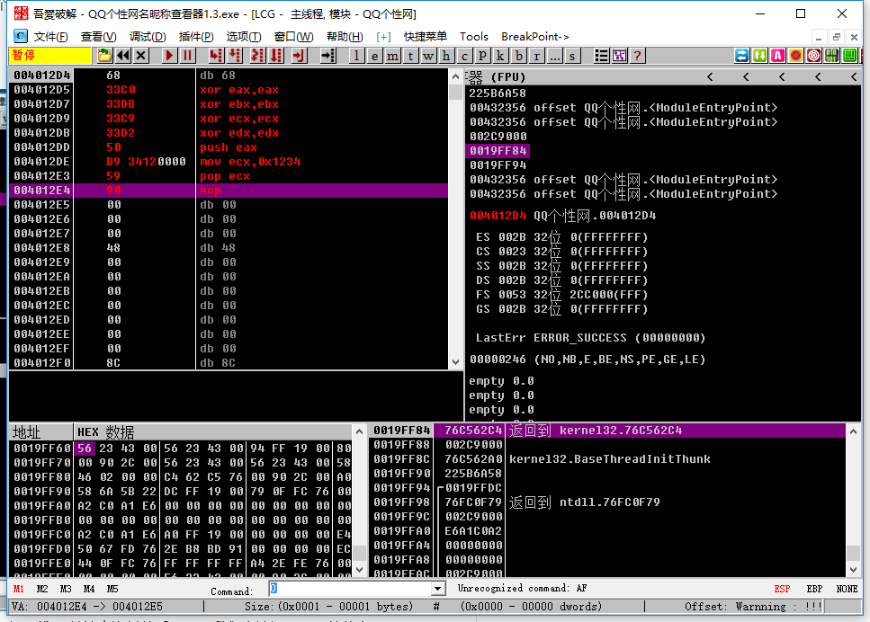
F8单步运行得到四个寄存器全部置0：
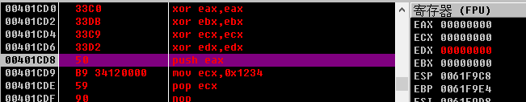
执行汇编指令 
```push eax
mov ecx,0x1234
pop ecx
```

2. push指令
```push eax```
把eax寄存器中的数据存储到堆栈中
```mov ecx，0x1234```
把1234赋值给ecx=0x1234
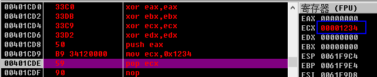
```pop ecx``
数据出栈并把所对应原栈顶的值赋值给ecx=0000

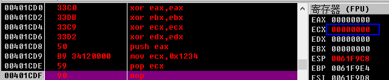


#### 熟悉OD
Ollydbg 将是我们以后用到的主要软件之一；之后对程序的分析还会结合IDA来进行逆向操作。

1. 左上角的窗口中，右键可以编写汇编指令。右上角的窗口显示了各个寄存器的状态和值。左下角是二进制以及十六进制的数据。右下角是堆栈的情况。

2. 如果想让OD从你指定的位置开始执行，可以直接F4运行到现在位置（即当前鼠标所选择的位置）；或者下断点，然后shift+F9运行到断点处即可。或者请`右击该行`，并选择`在此处新建EIP`。按`F7`键单步执行四次。

3. EIP的值，为当前高亮的代码行，表示即将要执行的语句，如图：
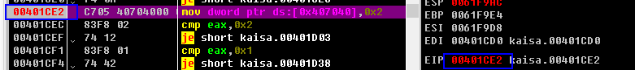

4. 通过堆栈窗口我们可以看到：
 1. 堆栈的结构是`从下往上减少`；
 2. 栈顶的位置是`0061f9c4`；
堆栈如图，`push eax`后栈顶数据变为0000：
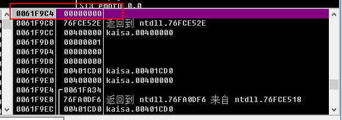
出栈后栈顶元素变回原始值，栈顶位置变为`0061f9c8`：
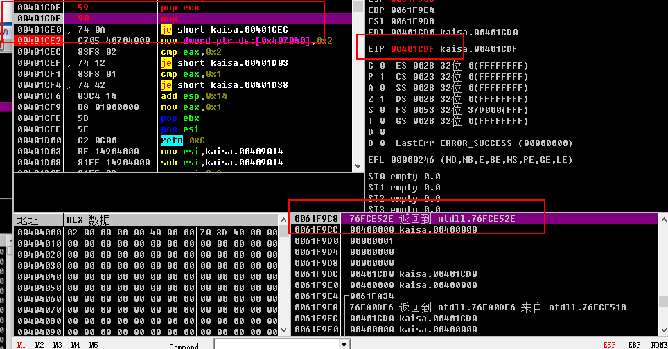
 3. 两个相邻的栈地址相差`4h`。

#### 对堆栈的小感悟
堆栈中push是把寄存器的值存储进去，与寄存器无关；pop是把栈顶元素从堆栈中删除，然后把值赋给pop 后面的寄存器中。所以堆栈就是一种用于存储数据的特殊结构，那么后面的作业就有思路啦。

#### 作业
设EAX为00001111h，EBX为00002222h，请交换两个寄存器的值。 要求：不允许使用`xchg`和`mov`指令

这个问题实际就是利用堆栈来进行两个寄存器值的交换。
编写汇编程序：
```xor ecx,ecx
xor edx,edx
mov eax,0x1111
mov ebx,0x2222
push eax #把数据0x1111入栈，并作为栈顶元素
push ebx #把数据0x2222入栈，并作为新的栈顶元素
pop eax  #把数据0x2222出栈（从栈中删除），并赋值给eax
pop ebx  #把数据0x1111出栈（从栈中删除），并赋值给ebx
```
最后eax=0x2222;ebx=0x1111;成功实现寄存器中数值的交换，运行过程如图：
1. 把程序写入OD

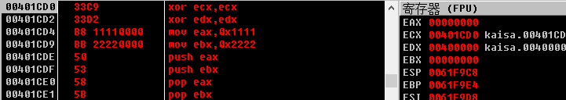

2. 运行，赋值

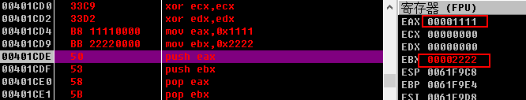

3. 入栈，出栈，并执行`pop eax`,发现eax值变为0x2222:

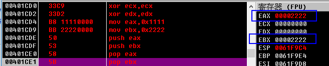

4. 出栈，执行`pop ebx`

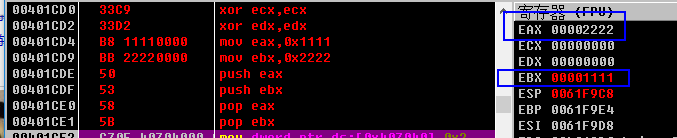

即完成两个寄存器中值的转换。


