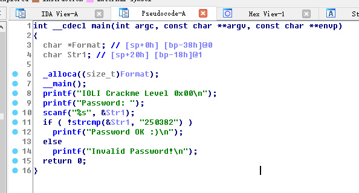
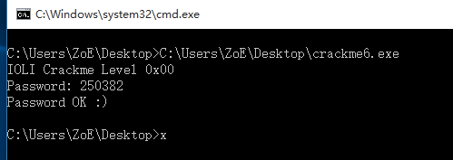

### 《RE4B》学习
###  《逆向工程权威指南》
##### 第一个样例-----HELLO WORLD

首先是c语言的代码详细如下：
```
#include <stdio.h>
int main()
{
	printf("Hello, world!\n");
	return 0;
}
```
然后利用MSVC编译器对其进行编译：
```
CONST   SEGMENT
$SG3830 DB       'hello, world', 0AH, 00H
CONST   ENDS
PUBLIC  _main
EXTRN   _printf:PROC
; Function compile flags: /Odtp
_TEXT   SEGMENT
_main   PROC
        push    ebp
        mov     ebp, esp
        push    OFFSET $SG3830
        call    _printf
        add     esp, 4
        xor     eax, eax
        pop     ebp
        ret     0
_main   ENDP
_TEXT   ENDS
```
1. 汇编语言存在两种主流语体，即Intel语体和AT&T语体。MSVC生成的汇编清单文件都采用了Intel语体。
2. 有const segment和const ends、_TEXT SEGMENT和 _TEXT  ENDS；这里的const和 _TEXT表示的是数据段和代码段的意思，分别表示其开始和结束。
3. 编译器在字符串常量的尾部添加了十六进制的数字0，即00h。依据C/C++字符串的标准规范，编译器要为这个字符串常量添加结束标志（即数值为零的单个字节）。
4. C/C++程序为字符串常量"hello, world!"分配了一个指针(cost char[])，只是在代码中这个指针的名称并不明显。然后，编译器自己进行了处理，并在内部把字符串常量命名为$SG5328。

**则上述程序源代码可以等价为：**
```
#include <stdio.h>
const cahr *$SG5328[] = "hello, world!\n";
int main()
{
	printf($SG5328);
	return 0;
}
```
5. 在代码段`_TEXT`只有1个函数，即主函数main()。在汇编指令清单里，主函数的函数体有标志性的函数序言（function prologue）和函数尾声（function epilogue）。实际上所有的函数都有这样的序言和尾声。在函数的序言标志之后，我们能够看到调用printf()函数的指令:` CALL _printf`。

6. 通过PUSH指令，程序把字符串的指针推送入栈。这样，printf()函数就可以调用栈里的指针，即字符串“hello, world!”的地址。

7. 在printf()函数结束以后，程序的控制流会返回到main()函数之中。此时，字符串地址（即指针）仍残留在数据栈之中。这个时候就需要调整栈指针（ESP寄存器里的值）来释放这个指针。

8. 下一条语句是`add ESP，4`，把ESP寄存器（栈指针/Stack Pointer）里的数值加4。(为什么要加上“4”？这是因为x86平台的内存地址使用`32位`（即`4字节`）数据描述。同理，在`x64`系统上释放这个指针时，ESP就要加上`8`。)因此，这条指令可以理解为**POP某寄存器**。只是本例的指令直接舍弃了栈里的数据而POP指令还要把寄存器里的值存储到既定寄存器。某些编译器（如Intel C++编辑器）不会使用ADD指令来释放数据栈，它们可能会用`POP ECX`指令。例如，Oracle RDBMS（由Intel C++编译器编译）就会用POP ECX指令，而不会用ADD指令。虽然POP ECX命令确实会修改ECX寄存器的值，但是它也同样释放了栈空间。Intel C++编译器使用POP ECX指令的另外一个理由就是，POP ECX对应的OPCODE（1字节）比ADD ESP的OPCODE（3字节）要短。

9. 在上述C/C++程序里，printf()函数结束之后，main()函数会返回0（函数正常退出的返回码）。即main()函数的运算结果是0。这个返回值是由指令“XOR EAX, EAX”计算出来的。对于置0，编译器通常采用异或运算指令，而不会使用“MOV EAX，0”指令。主要是因为异或运算的opcode较短（2字节:5字节）。也有一些编译器会使用“SUB EAX,EAX”指令把EAX寄存器置零，其中SUB代表减法运算。总之，main()函数的最后一项任务是使EAX的值为零。

10. 汇编列表中最后的操作指令是RET，将控制权交给调用程序。通常它起到的作用就是将控制权交给操作系统，这部分功能由C/C++的CRT实现。

注：函数调用约定，后面一条指令会把EAX的值当作返回值传递给调用者函数，而调用者函数(caller)会从EAX寄存器里取值， 把它当作返回结果。

##### 函数序言
函数序言是函数在启动的时候运行的一系列指令。其汇编指令大致如下：
```
push ebp  //保护现场原先的ebp指针
mov ebp,esp //将ESP的值复制到EBP寄存器
sub esp,X
```
在函数执行期间，EBP寄存器不受函数运行的影响，它是函数访问`局部变量`和`函数参数`的基准值。虽然我们也使用ESP寄存器存储局部变量和运行参数，但是ESP寄存器的值总是会发生变化，使用起来并不方便。
##### 函数尾声
函数在退出时，要做启动过程的反操作，释放栈中申请的内存，还原EBP寄存器的值，将代码控制权还原给调用者函数。
```
mov esp,ebp  //保护现场指针
pop ebp  //将原先的地址赋给ebp
ret 0 //将控制权交给操作系统
```

#### GCC
我们使用反汇编工具IDA查看main()函数的具体情况（F5反编译）。IDA所输出的汇编指令的格式，与MSVC生成的汇编指令的格式相同，它们都采用Intel语体显示汇编指令。
```
Main         proc near
var_10       = dword ptr -10h
             push    ebp
             mov     ebp, esp
             and     esp, 0FFFFFFF0h
             sub     esp, 10h
             mov     eax, offset aHelloWorld ; "hello, world\n"
             mov     [esp+10h+var_10], eax
             call    _printf
             mov     eax, 0
             leave
             retn
main         endp
```
+ 它首先把“hello, world”字符串在数据段的地址（指针）存储到EAX寄存器里，然后再把它存储在数据栈里。
+ 其中值得注意的还有开场部分的“AND ESP, 0FFFFFFF0h”指令。它令栈地址（ESP的值）向16字节边界对齐（成为16的整数倍），属于初始化的指令。如果地址位没有对齐，那么CPU可能需要访问两次内存才能获得栈内数据。虽然在8字节边界处对齐就可以满足32位x86 CPU和64位x64 CPU的要求，但是主流编译器的编译规则规定“程序访问的地址必须向16字节对齐（被16整除）”。人们还是为了提高指令的执行效率而特意拟定了这条编译规范。
+ “SUB ESP，10h”将在栈中分配0x10 bytes，即16字节。我们在后文看到，程序只会用到4字节空间。但是因为编译器对栈地址（ESP）进行了16字节对齐，所以每次都会分配16字节的空间。
+ 而后，程序将字符串地址（指针的值）直接写入到数据栈。此处，GCC使用的是MOV指令；而MSVC生成的是PUSH指令。其中var_10是局部变量，用来向后面的printf()函数传递参数。随即，程序调用printf()函数。

Intel语体和AT&T语体的区别

1. 运算表达式的书写顺序相反。
       (1)  Intel 格式：<指令> <目标> <源>
       (2)  AT&T 格式：<指令> <源> <目标> 如果我们将Intel语体的指令认为是等号（=）赋值，那么AT&T语体结构使用的就是右箭头（->)进行赋值。部分C标准函数的运算单元的书写格式确实是相同的，例如memcpy()、strcpy()。
2. AT&T语体中，在寄存器名称之前使用百分号（%）标记，在立即数之前使用美元符号（$）标记。AT&T语体使用圆括号，而Intel语体使用方括号。
3. AT&T语体里，每个运算操作符都需要声明操作数据的类型： -9：quad（64位） -l：指代32位long类型数据 -w：指代16位word类型数据 -b：指代8位byte类型数据

详细比较：
http://blog.csdn.net/21aspnet/article/details/7176915

**使用不同的编译器对相同代码进行编译形成的汇编程序，在语法上可能会有些许不一样，但实际上原理是基本一致的。而且在某些细节上还是保持一致的，比如：最后的`ret 0`，数据段和代码段，置0时用异或运算来进行实现等等。**

#### ARMARM 
几个ARM编译器：
+ 2013年6月版本的Keil编译器。
+  Apple Xcode 4.6.3 IDE (含LLVM-GCC 4.2编译器) 
+ 面向 ARM64的GCC 4.9 (Linaro)，其32位的Windows程序可由下述网址下载：
http://www.linaro.org/projects/armv8/

程序使用`R0`寄存器传递函数返回值。 ARM 程序使用`LR`寄存器(Link Register)存储函数结束之后的返回地址(RA/ Return Address)。x86 程序使用“栈”结构存储上述返回地址。 BX LR指令的作用是跳转到返回地址，即返回到调用者函 数，然后继续执行调用体 caller 的后续指令。
**详细学习参考网址：**
1. http://www.epubit.com.cn/book/onlinechapter/51419#anchor35
2. https://github.com/DigBullTech-Michael/ctf_re/blob/master/tutorials/171207_6th.md

#### 栈帧
本例使用寄存器来传递文本字符串的地址。但是它同时设置了局部栈，这是为什么呢？由于程序在调用printf()函数的时候由于程序必须保存RA寄存器的值和GP的值，故而此处出现了数据栈。如果此函数是叶函数，它有可能不会出现函数的序言和尾声，有关内容请参见本书(《逆向工程权威指南》)的2.3节。
#### Radare 2
详细的安装以及介绍：
http://www.360zhijia.com/360anquanke/301347.html

### 作业
#### crackme6
直接IDA查看main函数：



得到密码，但是直接运行crackme6程序，输入密码后会直接提示成功后就闪退；

解决方法：在命令行界面运行程序



密码：250382


