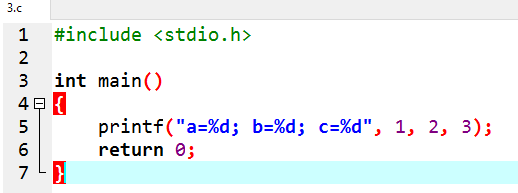
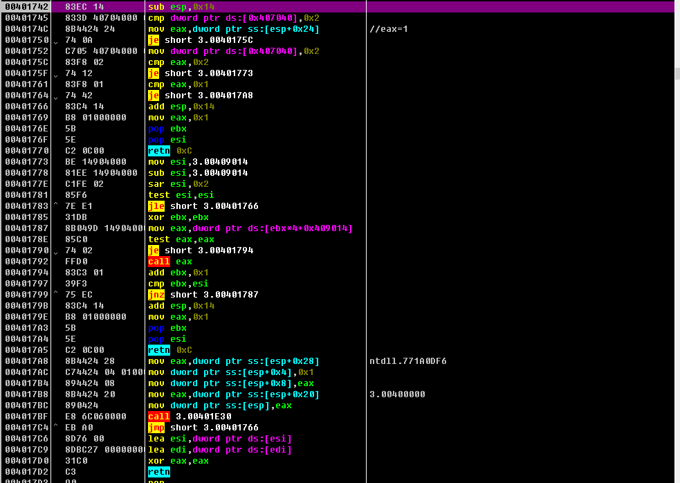
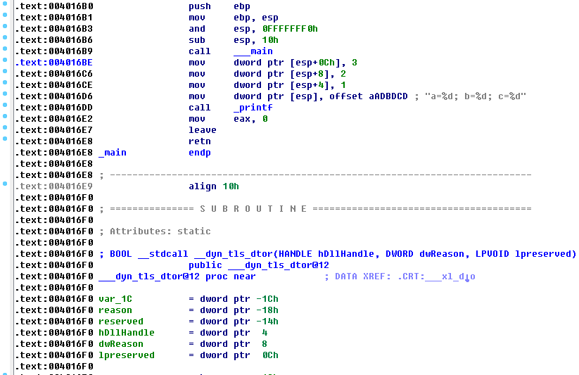

### 程序传递参数汇编过程
参考文章：https://github.com/DigBullTech-Michael/ctf_re/blob/master/tutorials/171219_8th.md
#### 三个参数
源程序：
```
#include <stdio.h>

int main()
{
	printf("a=%d; b=%d; c=%d", 1, 2, 3);
	return 0;
}
```
#### 九个参数
源程序：
```
#include <stdio.h>

int main()
{
	printf("a=%d; b=%d; c=%d; d=%d; e=%d; f=%d; g=%d; h=%d\n", 1, 2, 3, 4, 5, 6, 7, 8);
	return 0; 
};
```
### x86
#### x86：传递3个参数
##### MSVC
使用 MSVC 2010 express 编译上述程序，可得到下列汇编指令:
```
	$SG3830 DB		'a=%d; b=%d; c=%d’, 00H
	...
		push 3
		push 2
		push 1
		push OFFSET $SG3830 
		call _printf
		add esp, 16		;00000010H
		
```
这与最初的 Hello World 程序相差不多。我们看到 printf()函数的`参数以逆序存入栈`里，即第一个参数在最后入栈。
在 32 位环境下，`32 位地址指针和 int 类型数据都占据 32 位/4 字节空间`。所以，我们这里的四个参数 总共占用 4×4=16(字节)的存储空间。
在调用函数之后，`ADD ESP, X`指令修正ESP寄存器中的栈指针。通常情况下，我们可以`通过call 之后的这条指令判断参数的数量:变量总数=X÷4`。
这种判断方法仅适用于调用约定为cdecl的程序。

如果某个程序连续地调用多个函数，且调用函数的指令之间不夹杂其他指令，那么编译器可能把释放参数存储空间的`ADD ESP,X`指令进行合并，一次性地释放所有空间。例如:
```
push a1 
push a2 
call ... 
...
push a1 
call ...  //连续地调用多个函数
...
push a1 
push a2 
push a3 
call ... 
add esp, 24 //合并，一次性地释放所有空间
```


###下面用传递三个参数形成的程序分别在OD、IDA中进行分析

#### 传递三个参数(OD)
首先根据源码创建一个C程序(**这里程序名为“3”**)



OD单步运行观察：


源代码如下，对部分分析：
```
00401742    83EC 14         sub esp,0x14
00401745    833D 40704000 0>cmp dword ptr ds:[0x407040],0x2
0040174C    8B4424 24       mov eax,dword ptr ss:[esp+0x24];              //eax=1
00401750    74 0A           je short 3.0040175C           
00401752    C705 40704000 0>mov dword ptr ds:[0x407040],0x2
0040175C    83F8 02         cmp eax,0x2                        //Z=0
0040175F    74 12           je short 3.00401773                //Z=0，跳转不实现
00401761    83F8 01         cmp eax,0x1                        //Z=1
00401764    74 42           je short 3.004017A8                //Z=1，跳转实现
00401766    83C4 14         add esp,0x14
00401769    B8 01000000     mov eax,0x1
0040176E    5B              pop ebx
0040176F    5E              pop esi
00401770    C2 0C00         retn 0xC
00401773    BE 14904000     mov esi,3.00409014
00401778    81EE 14904000   sub esi,3.00409014
0040177E    C1FE 02         sar esi,0x2
00401781    85F6            test esi,esi
00401783  ^ 7E E1           jle short 3.00401766
00401785    31DB            xor ebx,ebx
00401787    8B049D 14904000 mov eax,dword ptr ds:[ebx*4+0x409014]
0040178E    85C0            test eax,eax
00401790    74 02           je short 3.00401794
00401792    FFD0            call eax
00401794    83C3 01         add ebx,0x1
00401797    39F3            cmp ebx,esi
00401799  ^ 75 EC           jnz short 3.00401787
0040179B    83C4 14         add esp,0x14
0040179E    B8 01000000     mov eax,0x1
004017A3    5B              pop ebx
004017A4    5E              pop esi
004017A5    C2 0C00         retn 0xC
004017A8    8B4424 28       mov eax,dword ptr ss:[esp+0x28]          ; ntdll.771A0DF6   //跳转到这里
004017AC    C74424 04 01000>mov dword ptr ss:[esp+0x4],0x1                      //参数赋值
004017B4    894424 08       mov dword ptr ss:[esp+0x8],eax
004017B8    8B4424 20       mov eax,dword ptr ss:[esp+0x20]          ; 3.00400000
004017BC    890424          mov dword ptr ss:[esp],eax               //这里的“dword ptr”是双字节传输的意思
004017BF    E8 6C060000     call 3.00401E30                      //调用函数
004017C4  ^ EB A0           jmp short 3.00401766            //若F4不执行这个跳转，回出现跑飞直接打印的情况
004017C6    8D76 00         lea esi,dword ptr ds:[esi]      //目标地址传送指令
004017C9    8DBC27 00000000 lea edi,dword ptr ds:[edi]      //目标地址传送指令
004017D0    31C0            xor eax,eax                     //自身进行异或运算，置0，为返回值

```

##### 汇编指令小笔记
**CMP指令**

比如cmp ah,al。
及进行ah-al操作，不过不保存结果，只影响标志位。
jnc和jc即根据cf标志位的结果进行跳转。
至于如何影响：如果减数大于被减数，此时有借位。则将cf位置1，否则置0.
```
MOV AH,O
CMP AH ,AL
JNC L2(l2 程序略)
```
ah-al>0，则减数不大于被减数。cf置0，jnc(jump if not cf)条件成立，则跳转到l2，ah为两者之中较大的一个。

**跳转**

JC        有进位时转移. 
JNC     无进位时转移
JE       (ZF)=1,则控制转移
JNE    (ZF)=0,则控制转移

各跳转详解参考博客：http://blog.csdn.net/ssihc0/article/details/5215044
#### 传递三个参数(IDA)
导入程序，然后进入main函数：




```
.text:004016B0                 push    ebp
.text:004016B1                 mov     ebp, esp
.text:004016B3                 and     esp, 0FFFFFFF0h
.text:004016B6                 sub     esp, 10h
.text:004016B9                 call    ___main
.text:004016BE                 mov     dword ptr [esp+0Ch], 3
.text:004016C6                 mov     dword ptr [esp+8], 2
.text:004016CE                 mov     dword ptr [esp+4], 1
.text:004016D6                 mov     dword ptr [esp], offset aADBDCD ; "a=%d; b=%d; c=%d"
.text:004016DD                 call    _printf
.text:004016E2                 mov     eax, 0
.text:004016E7                 leave
.text:004016E8                 retn
.text:004016E8 _main           endp
.text:004016E8
.text:004016E8 ; ---------------------------------------------------------------------------
.text:004016E9                 align 10h
.text:004016F0
.text:004016F0 ; =============== S U B R O U T I N E =======================================
.text:004016F0
.text:004016F0 ; Attributes: static
.text:004016F0
.text:004016F0 ; BOOL __stdcall __dyn_tls_dtor(HANDLE hDllHandle, DWORD dwReason, LPVOID lpreserved)
.text:004016F0                 public ___dyn_tls_dtor@12
.text:004016F0 ___dyn_tls_dtor@12 proc near            ; DATA XREF: .CRT:___xl_do
.text:004016F0
.text:004016F0 var_1C          = dword ptr -1Ch
.text:004016F0 reason          = dword ptr -18h
.text:004016F0 reserved        = dword ptr -14h
.text:004016F0 hDllHandle      = dword ptr  4
.text:004016F0 dwReason        = dword ptr  8
.text:004016F0 lpreserved      = dword ptr  0Ch
.text:004016F0
```

其中提取部分进行分析

```
.text:004016B0                 push    ebp   //保存现场
.text:004016B1                 mov     ebp, esp
.text:004016B3                 and     esp, 0FFFFFFF0h
.text:004016B6                 sub     esp, 10h
.text:004016B9                 call    ___main
.text:004016BE                 mov     dword ptr [esp+0Ch], 3  //逆向传递参数
.text:004016C6                 mov     dword ptr [esp+8], 2    //四个字节存储一个数字
.text:004016CE                 mov     dword ptr [esp+4], 1    //四个字节存储一个数字
.text:004016D6                 mov     dword ptr [esp], offset aADBDCD ; "a=%d; b=%d; c=%d"
.text:004016DD                 call    _printf    //调用printf函数，打印esp寄存器里面的内容
.text:004016E2                 mov     eax, 0    //置0，返回值
.text:004016E7                 leave
.text:004016E8                 retn
.text:004016E8 _main           endp
```


**体会**：直接对应用程序进行分析的时候，IDA会比较好用，动态分析OD比较好用，对于本次传递参数的分析中，还是使用 MSVC 2010 express 编译程序，把得到的汇编指令在OD里面运行会比较好理解。
