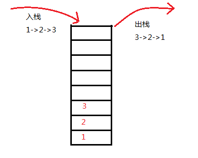
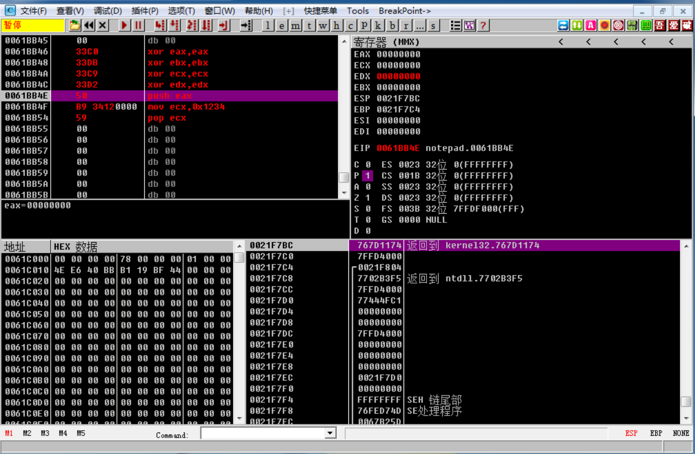
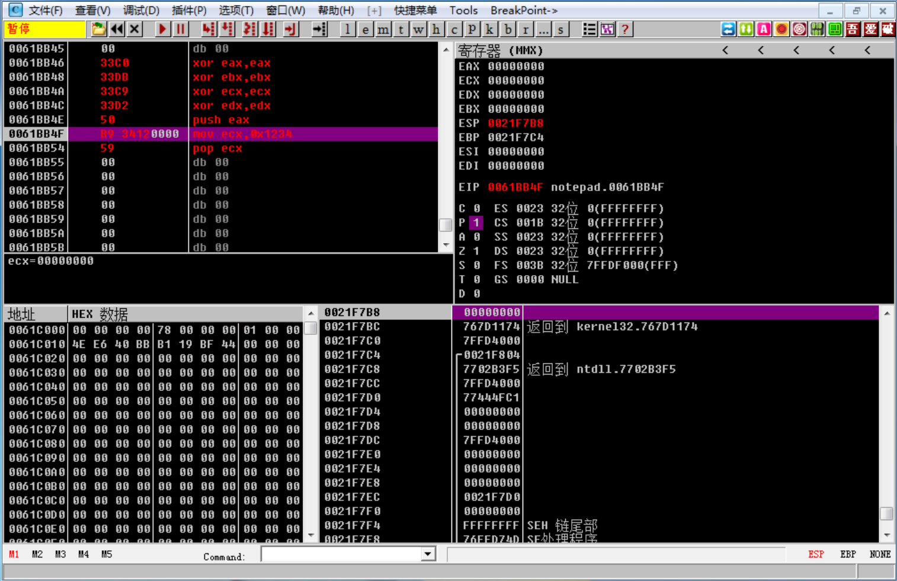
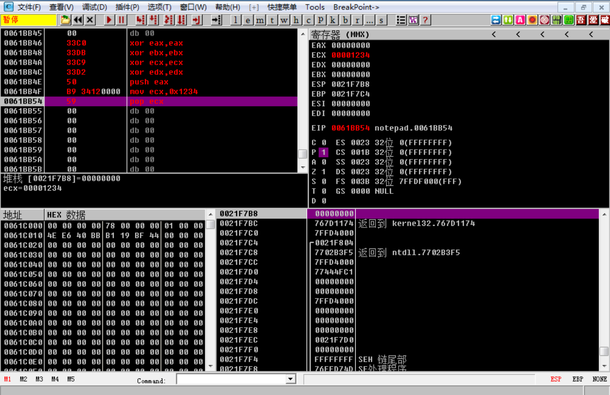
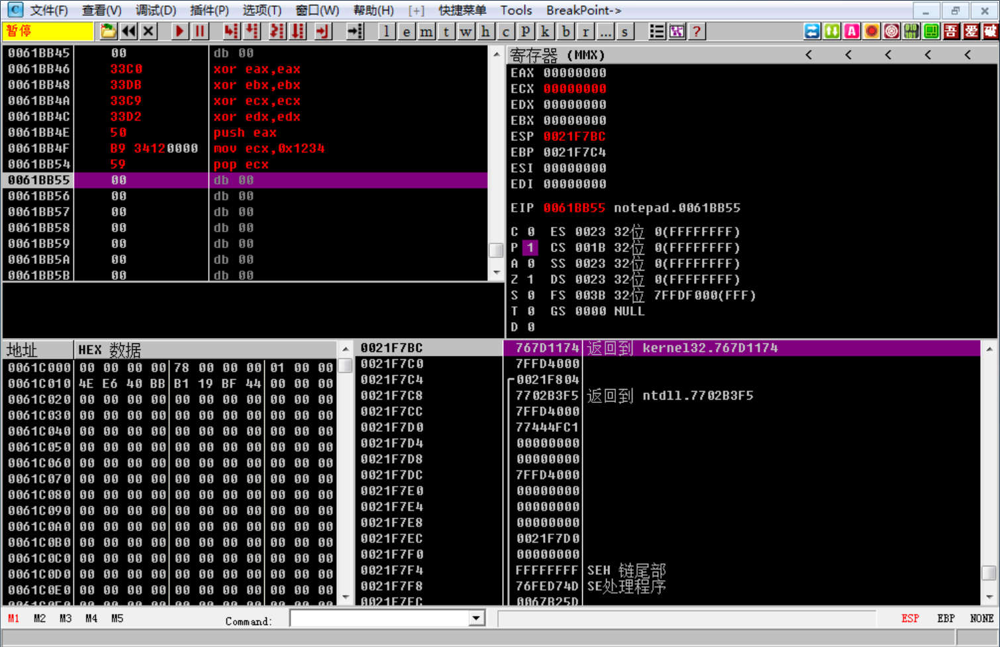

## 堆栈
### 基本概念

1. 堆栈是一个先进后出（FILO）的线性表
`FILO`是指：`最后`放进表中的数据在`取出`时，`最先`出来，即 Fist in Last Out。


2. 系统堆栈不仅仅是一段内存。
由于CPU对它实施管理，因此你不需要考虑堆栈指针的修正问题。可以把寄存器内容，甚至一个立即数直接放入堆栈里，并在需要的时候将其取出。同时，系统并不要求取出的数据任然回到原来的位置。

### 堆栈相关指令

除了显示地操作堆栈（使用`push`和`pop`指令）之外，很多指令也需要使用堆栈，如`INT`、`CALL`、`LEAVE`、`RET`、`RETE`、`IRET`等等。配对使用上述指令并不会造成什么问题，然而，如果你打算使用LEAVE、RET、RETE、IRET这样的指令实现跳转（比JMP更为麻烦，然而有时，例如在加密软件中，或者需要修改调用者状态时这是必要的）的话，那么要搞清楚他们做的到底是什么，并且精确而了解自己要做什么。

#### push/pop指令
`push 寄存器`：将一个寄存器中的数据`压入`堆栈；
`pop 寄存器`：将`栈顶`的数据`弹出`堆栈，并传入指定的寄存器。
```
push ax			;将ax中的数据入栈
pop ax			;将堆栈栈顶的数据弹出并传送给ax
```
`push 段寄存器`：将一个段寄存器中的数据压入堆栈；
`pop 段寄存器`：将栈顶表示的数据弹出，并传入端寄存器。
```
push ds
pop ds
```
`push 内存单元`：将一个内存单元处的数据压入堆栈；
`pop 内存单元`：将栈顶表示的数据弹出，并传入内存单元。
```
push [0]			;将DS:[0]的数据压入堆栈
pop [0]			;将栈顶数据弹出，并传入DS:[0]
```
8086CPU的入栈和出栈都是以`字`为单元的。

### 简单实践
>请各位同学自行下载`OllyDBG`，然后用OD随便打开一个程序，比如notepad.exe，然后鼠标滚动反汇编窗口，直到遇到空的地方。

#### 初始化


Ollydbg 将是我们以后用到的主要软件之一。请各位同学自行下载， 并搜索资料熟悉一下。
我们来认识下上图的信息：

1. 左上角的窗口中，我们可以编写汇编指令。右上角的窗口显示了各个寄存器的状态和值。左下角是二进制以及十六进制的数据。右下角是堆栈的情况。

2. 如果想让OD从你指定的位置开始执行，请`右击该行`，并选择`在此处新建EIP`。按`F7`键单步执行四次。

3. 执行完上述四条XOR指令之后，我们将EAX／EBX／ECX／EDX成功清零。

4. EIP的值，为当前高亮的代码行，表示即将要执行的语句。

5. 通过堆栈窗口我们可以看到：
 1. 堆栈的结构是`从下往上减少`；
 2. 栈顶的位置是`0021f7bc`；
 3. 两个相邻的栈地址相差`4h`。

#### POP／PUSH操作

* `PUSH EAX`：

在我们执行了push操作之后，栈顶变为了`0021f7b8`，而这个地址对应的数据为`00000000`(h)。

* `MOV ECX,1234h`:


* `POP ECX`:

注意ECX值的变化。通过mov指令，我们给ECX传入了0x1234h，但是通过pop指令，我们将栈顶的EAX的值，弹出了堆栈，并且传递给了ECX，同时ESP栈顶`+4`变为了push eax之前的地址。

请各位同学自行实验并理解堆栈的使用和操作。

### 作业

设EAX为00001111h，EBX为00002222h，请交换两个寄存器的值。
**要求：不允许使用`xchg`和`mov`指令**
